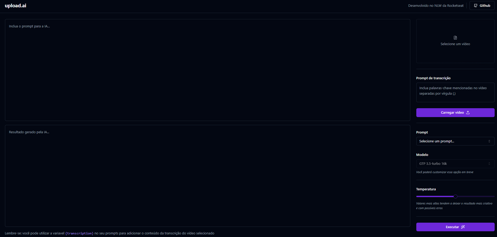

# UPLOAD AI


> Aplicação para upload de videos utilizando inteligência artificial realizado no desafio da NLW AI da [Rocketseat](app.rocketseat.com.br)

<div style="width:100%; display:flex; align-items:center; gap:16px">

</div>

## Detalhes do aplicativo

- Nesse projeto foi criado uma plataforma que recebe o upload de um e cria um título ou descrição para o vídeo utilizando inteligência artificial baseando-se na transcrição do conteúdo do vídeo enviado.
Foi abordado diversos conceitos como requisições para API's gratuitas de inteligência artificial como a openai api, acessibilidade, estilização com Tailwind CSS e Shadcn/ui, além componentização padrão com Radix UI.
É um projeto excelente para criação de títulos e legendas criativas para enviar um vídeo para o Youtube.


## 🚀 Melhorias implementadas
- [x] - Componentização com Radix UI
- [x] - Requisições com Fastify
- [x] - Estilização com Tailwind CSS e shadcn/ui
- [x] - Biblioteca de icones lucide-react
- [x] - Utilizado a api da OpenAi


## 💻 Como usar o projeto
Para gerar uma cópia do projeto e implementar as suas melhorias, esteja em um computador com Node Js instalado e siga as etapas abaixo:

1  clone o projeto com o comando 
```
git clone https://github.com/devggui/upload-ai-web
``` 
2  Acesse o projeto pelo terminal com o comando 
```
cd upload-ai-web
```  
3  Instale as dependências necessárias com o comando
```
npm install
```
4  Rode o projeto com o comando
```
npm run dev
``` 
<!-- 5  Ou acesse o aplicativo através do website [upload.ai]()  -->

6  Após esses passos, acessar o repositório da [API](https://github.com/devggui/upload-ai-api) e seguir os passo informados no arquivo README.md


## 🌐 Links úteis
[NodeJS](https://nodejs.org/en/download)  
[Vite](https://vitejs.dev)  
[Radix UI](https://www.radix-ui.com)
[Tailwind CSS](https://tailwindcss.com)
[shadcn/ui](https://ui.shadcn.com)  
[Fastify](https://fastify.dev)
[Feather Icons](https://feathericons.com)
[OpenAi API](https://platform.openai.com)


## 🧑‍💻 Guilherme Henrique

[](https://www.linkedin.com/in/devggui)
[](https://gthub.com/devggui)
[](http://wa.me/5514998619263)
[](https://devggui.netlify.app)